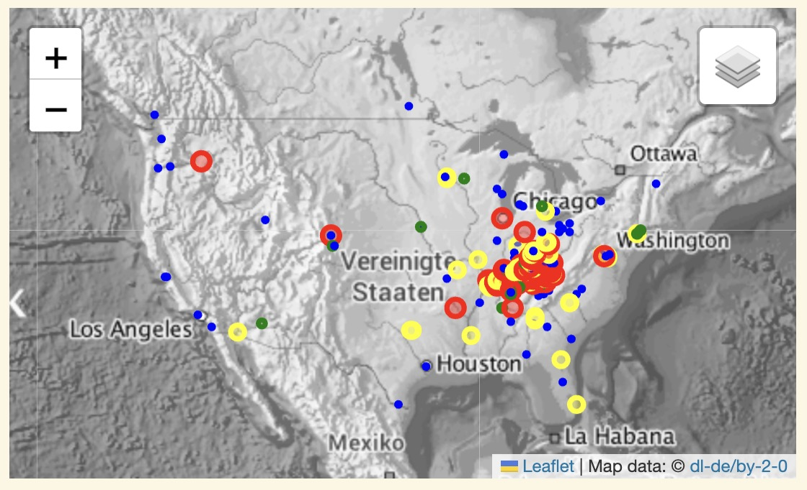

# Analyzing Monthly AWS S3 Logs for KyFromAbove Explorer Use

The [KyFromAbove Explorer](https://explore.kyfromabove.ky.gov) is a web app map viewer for Kentucky's Oblique Imagery.  Although the viewer is available for public consumption, one of the primary intended users is the Property Valuation Administrator, or  the PVA.  This product allows PVAs to view recently collected imagery that assists them view properties from several angles along with some other tools.  As you can imagine, acquiring oblique imagery in a statewide campaign is unprecedented.  By tackling this project at a statewide scale, discount pricing was acheived that save local governments money.

Kentucky is able to extends this savings as part of the [AWS Registry of Open Data](https://registry.opendata.aws/kyfromabove/), which covers the cost of imagery storage.  By extracting a dataset from the logs files for the month of November, I plan to analyze some data as it pertains to the source imagery for the KyFromAbove Explorer.

My primary questions:
 - How many requests does the bucket receive from the KyFromAbove Explorer?
 - How much data is consumed (in bytes)?
 - What are the most popular images?
 - Who is using the data?

___

### Procedures

Export data from AWS using Athena.
Run some pandas dataframe manipulations to answer my questions.
Create a map of users

### Setup

To get started clone this repo:

```bash
git clone https://github.com/ianhorn/codeky-da-module2-project.git

cd codeky-da-module2-project

python3 -m venv venv

source venv/bin/activate

pip install -r requirements.txt

```
---
### Download the data

There are two ways to download the data.  One is from the large csv file or downloading a compressed file and using gzip to decompress it.

```bash
# the compressed file
curl -LO https://ky.box.com/shared/static/i51gwqpefsgwyooodjtuy0ima6w8u6xg.gz

# use gzip to decompress
gzip -dc i51gwqpefsgwyooodjtuy0ima6w8u6xg.gz  > athena_output.csv

# uncompressed file
curl -LO https://ky.box.com/shared/static/h55nx1ca7ztcuzqvf8tu4g5q48t6lmqk.csv > athena.csv
```
You could also just use these links and then rename your file to *athena_output.csv*.  **Make sure you place it in the root project folder.**

Download the [CSV]( 'https://ky.box.com/shared/static/h55nx1ca7ztcuzqvf8tu4g5q48t6lmqk.csv') (4.18 GB) data file<br>
Download the [GZIP](https://ky.box.com/shared/static/i51gwqpefsgwyooodjtuy0ima6w8u6xg.gz) (667 MB) compressed csv data file.

# Notebook

Go to the [data-project notebook](data-project.ipynb#Analyzing) to see work flow.

___

# Summary

The first thing the dataframe tells is that this data set has 6,612,895 rows and 26 columns.  After dropping some columns and filtering for just the referrer *explore.kyfromabove.ky.gov* we're left with 1,833,992 rows and 7 columns.  

#### Filenames and GET Requests

I wanted to analyze GET requests per day, so I created a new column that extracted a date format from the datetime format.  

I also extracted the filename from the key value.
```python
# get basefile name
logs_filtered['filename'] = logs_filtered['key'].apply(os.path.basename)
logs_filtered['filename'].head(5)

28    Color_6146_14210.tif
29    Color_6146_14210.tif
30    Right_6144_13341.tif
31     Color_3086_4179.tif
32     Color_3086_4179.tif
Name: filename, dtype: object
```

This allowed me to see which image files in the S3 bucket are receiving the most requests.  Ideally, it would be nice to use [gdal](https://gdal.org) or similar type library to extract metadata from the files, which would give me a bounding box for the image, allowing me to map images and indexed polygons.  That's a lot of processing and beyond the scope of this project.

#### Egress (bytessent)

While it was interesting to see that we get average bytes sent rate of 3,191.23 bytes per second, I don't think this matters much.  The KyFromAbove Explorer entails a lot more than just pulling images from AWS.  I believe the log files specific to that App instance would be more relevant. 

If I had to do it again, I would just not worry about analyzing bytessent.  What's more interesting is looking at the [logs_objects](data-project.ipynb#Calculate). <br>
<center>
<figure>

</center><br>

We can see that the object size is much greater than the actual bytessent value.  This tells me that all the tranformations we did to make the imagery cloud-optimized is working.  

#### HTTP Status

This was an interesting bit of information.  It allowed me to see that over 99% of the files have [successful GET Requests](data-project.ipynb#HTTP).

#### Daily Requests

Grouping the images by day allowed us to to see the pattern usages.  It looks like that Tuesday - Thursday are the busiest days for usage.  

<br>

#### Users

For this section, I used the *remoteip* column to make an API call to [IPInfo](https://ipinfo.io) to geolocate users . . . at least their network locations.  

From these results, I exported a couple datasets as GeoJson or Geopackage which could then be further used in GIS software like QGIS or ArcGIS.  

After some tinkering with the requests numbers per location for categories, I symbolized CircleMarkers to add to a folium map.

You can view the web map in the notebook or by visiting the saved [html map](november-users-map.html).<br>
<br>
Of note is zooming into the Kentucky to see which County Seats are consuming the Explorer App a lot, and which aren't consuming at all.

___

# Conclusions

This was a great way to start analyzing our log files on AWS.  This project only focused on one referrer, but it would be more informative to look at the bucket requests as a whole.  The Oblique Imagery is only one aspect.  We also have LiDAR (elevation models and point clouds) and orthoimagery available.  

Analyzing this data could also be helpful in identifying areas or tools of interest.  Being able to use popular images to create documented examples might be on option for that sort of analysis.

Also, by not filtering the data to one referrer, we could get stats on individual users, the tools/software they use, and if any files are causing any http status errors.

Finally, by analyzing the data, we document the volume and frequency of the usage of the data.  Having this information handy will allow us to plan and transition as more computing relies on the cloud.  